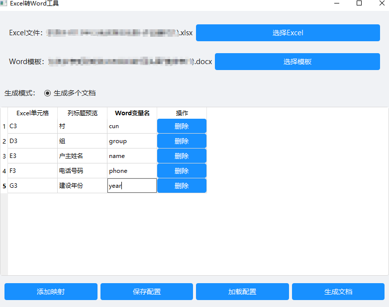

# Excel数据读取写入到Word模板中生成多个word工具

这是一个用于将Excel数据批量导入Word模板并生成多份文档的工具。

## 功能特点

- 支持选择Excel数据文件和Word模板文件
- 可视化配置Excel列名与Word变量的映射关系
- 支持保存和加载映射配置
- 批量生成Word文档
- 美观的图形用户界面

## 安装依赖

```bash
pip install -r requirements.txt
```

## 使用说明

1. 运行程序：
```bash
python main.py
```

2. 准备文件：
   - Excel数据文件（.xlsx或.xls格式）
   - Word模板文件（.docx格式），在模板中使用变量标记（如${name}）
   

3. 操作步骤：
   - 点击"选择Excel"按钮选择数据文件
   - 点击"选择模板"按钮选择Word模板
   - 点击"添加映射"添加Excel列名和Word变量的对应关系 （比如D3 与 ${name} 在程序上只需填写name即可  ）
   
   - 可以点击"保存配置"保存当前的映射关系
   - 点击"生成文档"开始批量生成Word文件

4. 配置说明：
   - Excel列名：填写Excel文件中的列标题名称
   - Word变量名：填写Word模板中对应的变量名（需要与模板中的变量完全一致）

## 打包exe说明

1. 运行程序：
```bash
pyinstaller -F -w -i excelToWord.ico main.py
```
然后去dist中找到 main.exe 双击运行即可


## 注意事项

- Word模板中的变量请使用统一的格式，如${变量名}
- 确保Excel中的列名与配置的映射关系完全匹配
- 生成的文档会自动以"生成文档_序号.docx"的格式命名 
